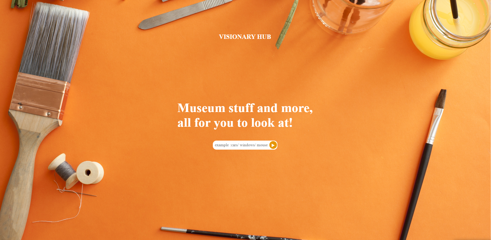

# Visionary Hub

A web application that generates items, images, and paintings from an API Database.

Link to project: Visionary Hub

## How It's Made:
Tech used: HTML5, CSS3, JavaScript

## To-Do Optimizations:

Display Multiple Items:

Enhance the user experience by displaying multiple paintings or objects at once on the application interface.
Lessons Learned:

API Integration: Gained valuable experience in working with APIs to fetch and display dynamic content on the web application.

## Future Development Ideas:

User Preferences:

Implement user preferences to allow customization of the types of items or paintings generated.
Filtering and Sorting:

Add filtering and sorting options to enable users to refine the displayed content based on specific criteria.
Responsive Design:

Ensure optimal viewing experience across various devices with a focus on responsive design.